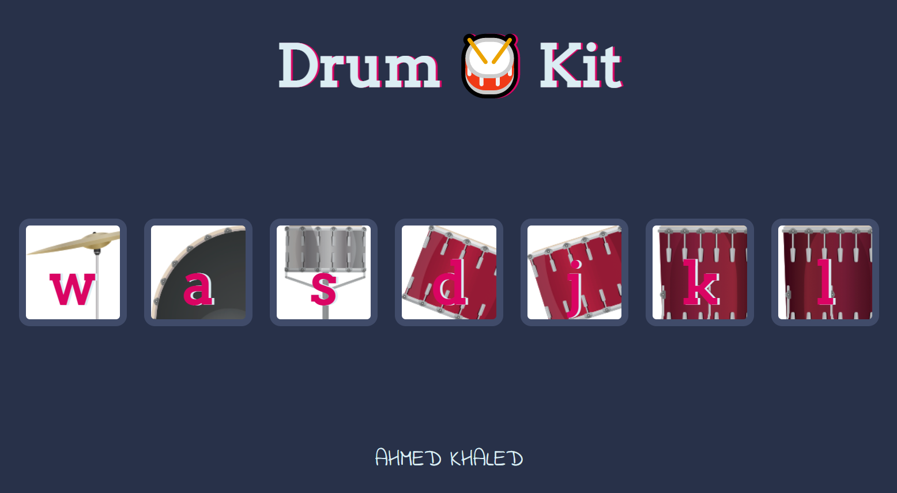

## Drum kit
A simple web application implemented using HTML, CSS, and JavaScript.    
The is a drum kit that can be controlled using mouse clicks or keyboard keys.  

[Try the hosted version](https://ahmed-khaled24.github.io/Drum-Kit/)

## Image of the application
